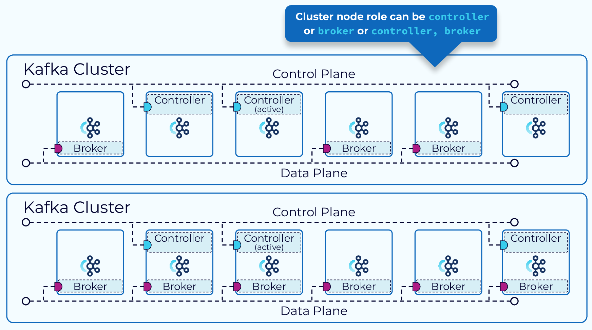
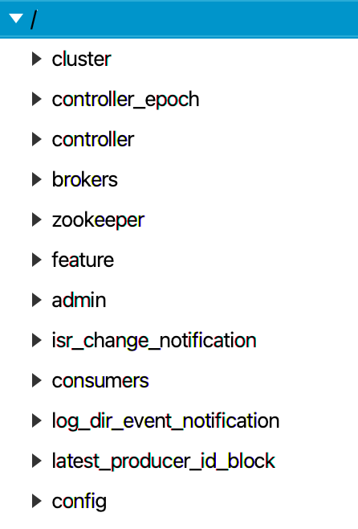
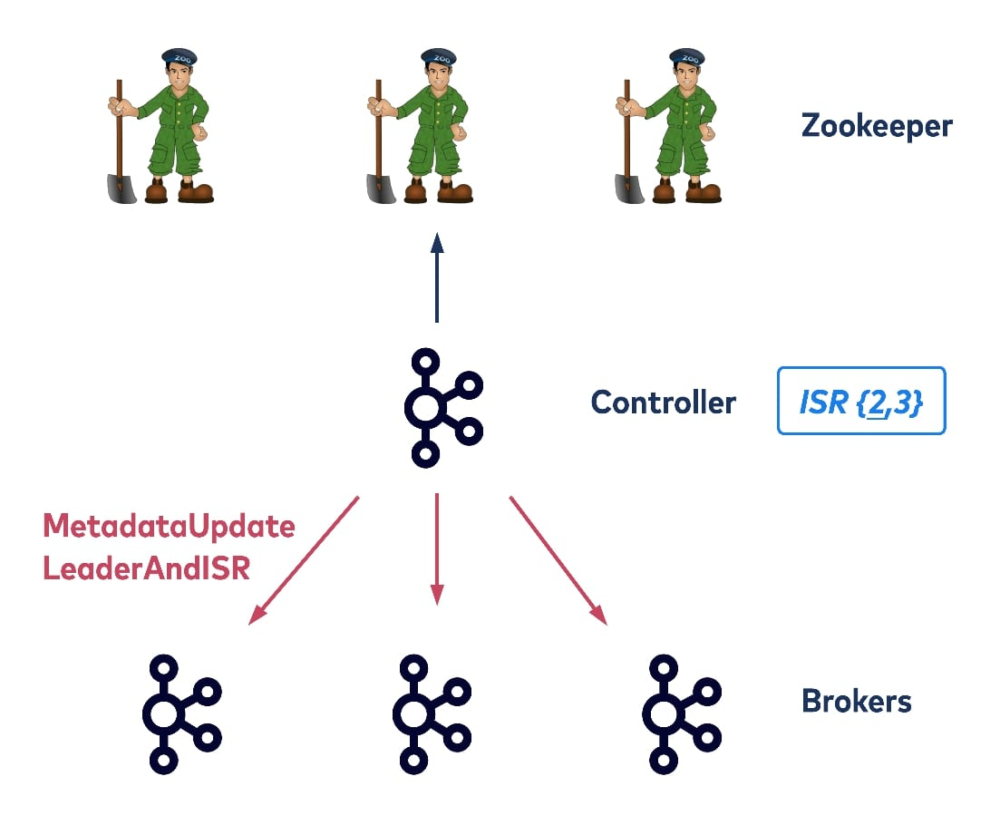
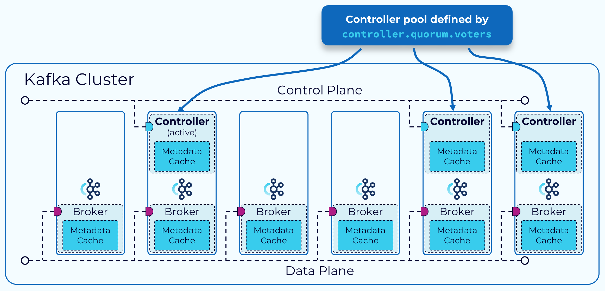
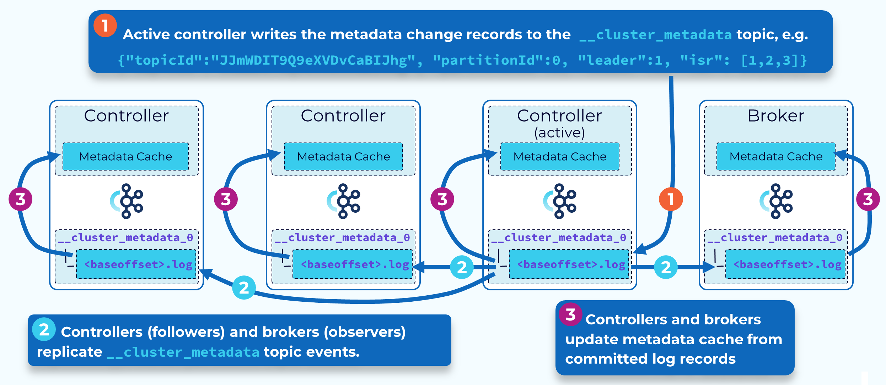
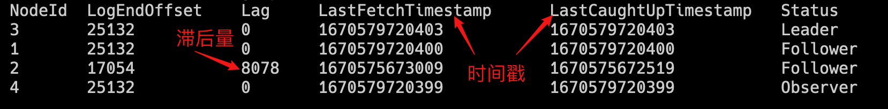
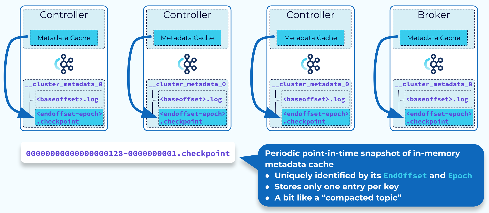

# Kafka KRaft模式介绍

**Kafka 2.8**版本引入一个重大改进：KRaft模式。这个功能一直处于实验阶段。
2022年10月3日，**Kafka 3.3.1**发布，正式宣告**KRaft**模式可以用于生产环境。
在KRaft模式下，所有集群元数据都存储在Kafka内部主题中，由kafka自行管理，不再依赖zookeeper。

---

KRaft 模式有很多优点：

- **简化集群部署和管理** – 不在需要zookeeper，简化了kafka集群的部署和管理工作。资源占用更小。
- **提高可扩展性和弹性** – 单个集群中的分区数量可以扩展到数百万个。集群重启和故障恢复时间更短。
- **更高效的元数据传播** – 基于日志、事件驱动的元数据传播提高了 Kafka 许多核心功能的性能。

---

目前**KRaft**只适用于新建集群，将现有的集群从**zookeeper**模式迁移到**KRaft**模式，需要等**3.5**版本。
**3.5** 是一个桥接版本，将正式弃用**zookeeper**模式。
**Kafka 4.0** (预计2023年8月发布)将完全删除**zookeeper**模式，仅支持 **KRaft** 模式。

> 注意：**Kafka 3.3.0** 版本中存在重大bug，建议不要使用。

## KRaft部署

### 单节点部署

- 生成集群uuid

使用kafka提供的工具

```bash
./bin/kafka-storage.sh random-uuid
# 输入结果如下
# xtzWWN4bTjitpL3kfd9s5g
```

也可以自己生成，kafka集群的uuid应为16个字节的base64编码,长度为22

```bash
#集群的uuid应为16个字节的base64编码,长度为22
echo -n "1234567890abcdef" | base64 | cut -b 1-22
# MTIzNDU2Nzg5MGFiY2RlZg
```

- 格式化存储目录

```bash
./bin/kafka-storage.sh format -t xtzWWN4bTjitpL3kfd9s5g \
                       -c ./config/kraft/server.properties
# Formatting /tmp/kraft-combined-logs
```

> 注意：如果安装多个节点，每个节点都需要格式化。

- 启动kafka

```bash
./bin/kafka-server-start.sh ./config/kraft/server.properties
```

- 配置文件

```properties
# The role of this server. Setting this puts us in KRaft mode
process.roles=broker,controller
# The node id associated with this instance's roles
node.id=1
# The connect string for the controller quorum
controller.quorum.voters=1@localhost:9093
# Combined nodes (i.e. those with `process.roles=broker,controller`) must list the controller listener here at a minimum.
listeners=PLAINTEXT://:9092,CONTROLLER://:9093
# Name of listener used for communication between brokers.
inter.broker.listener.name=PLAINTEXT
# 如果要从别的主机访问，将localhost修改为你的主机IP
advertised.listeners=PLAINTEXT://localhost:9092
# This is required if running in KRaft mode.
controller.listener.names=CONTROLLER
# Maps listener names to security protocols, the default is for them to be the same. See the config documentation for more details
listener.security.protocol.map=CONTROLLER:PLAINTEXT,PLAINTEXT:PLAINTEXT,SSL:SSL,SASL_PLAINTEXT:SASL_PLAINTEXT,SASL_SSL:SASL_SSL
# A comma separated list of directories under which to store log files
log.dirs=/tmp/kraft-combined-logs
```

### docker compose部署



在Kraft模式下，可以将集群的节点设置为controller或borker，也可以同时扮演两种角色。
broker负责处理消息请求和存储主题分区日志，controller负责管理元数据，并根据元数据的变化指挥broker做出响应。
控制器在集群中只占一小部分，一般为奇数个(1,3,5,7),可以容忍不超过半数的节点失效。

```yaml
# kraft通用配置
x-kraft: &common-config
  ALLOW_PLAINTEXT_LISTENER: yes
  KAFKA_ENABLE_KRAFT: yes
  KAFKA_KRAFT_CLUSTER_ID: MTIzNDU2Nzg5MGFiY2RlZg
  KAFKA_CFG_PROCESS_ROLES: broker,controller
  KAFKA_CFG_CONTROLLER_LISTENER_NAMES: CONTROLLER
  KAFKA_CFG_LISTENER_SECURITY_PROTOCOL_MAP: BROKER:PLAINTEXT,CONTROLLER:PLAINTEXT
  KAFKA_CFG_CONTROLLER_QUORUM_VOTERS: 1@kafka-1:9091,2@kafka-2:9091,3@kafka-3:9091
  KAFKA_CFG_INTER_BROKER_LISTENER_NAME: BROKER

# 镜像通用配置
x-kafka: &kafka
  image: 'bitnami/kafka:3.3.1'
  networks:
    net:

# 自定义网络
networks:
  net:

# project名称
name: kraft
services:
  
  # combined server
  kafka-1:
    <<: *kafka
    container_name: kafka-1
    ports:
      - '9092:9092'
    environment:
      <<: *common-config
      KAFKA_CFG_BROKER_ID: 1
      KAFKA_CFG_LISTENERS: CONTROLLER://:9091,BROKER://:9092
      KAFKA_CFG_ADVERTISED_LISTENERS: BROKER://10.150.36.72:9092 #宿主机IP

  kafka-2:
    <<: *kafka
    container_name: kafka-2
    ports:
      - '9093:9093'
    environment:
      <<: *common-config
      KAFKA_CFG_BROKER_ID: 2
      KAFKA_CFG_LISTENERS: CONTROLLER://:9091,BROKER://:9093
      KAFKA_CFG_ADVERTISED_LISTENERS: BROKER://10.150.36.72:9093 #宿主机IP

  kafka-3:
    <<: *kafka
    container_name: kafka-3
    ports:
      - '9094:9094'
    environment:
      <<: *common-config
      KAFKA_CFG_BROKER_ID: 3
      KAFKA_CFG_LISTENERS: CONTROLLER://:9091,BROKER://:9094
      KAFKA_CFG_ADVERTISED_LISTENERS: BROKER://10.150.36.72:9094 #宿主机IP

  #broker only
  kafka-4:
    <<: *kafka
    container_name: kafka-4
    ports:
      - '9095:9095'
    environment:
      <<: *common-config
      KAFKA_CFG_BROKER_ID: 4
      KAFKA_CFG_PROCESS_ROLES: broker
      KAFKA_CFG_LISTENERS: BROKER://:9095
      KAFKA_CFG_ADVERTISED_LISTENERS: BROKER://10.150.36.72:9095
```

> 注意：1.如果部署在服务器或公有云上，请作如下修改：

```yaml
KAFKA_CFG_LISTENERS: CONTROLLER://:9091,BROKER://0.0.0.0:9092
KAFKA_CFG_ADVERTISED_LISTENERS: PLAINTEXT://服务器IP或公务IP:9092
```

### 查看元数据

```bash
# 创建主题
docker run -it --rm --network=kraft_net \
           bitnami/kafka:3.3.1 \
           /opt/bitnami/kafka/bin/kafka-topics.sh \
           --bootstrap-server kafka-1:9092,kafka-2:9093 \
           --create --topic my-topic \
           --partitions 3 --replication-factor 2

# 生产者
docker run -it --rm --network=kraft_net \
           bitnami/kafka:3.3.1 \
           /opt/bitnami/kafka/bin/kafka-console-producer.sh \
           --bootstrap-server kafka-1:9092,kafka-2:9093 \
           --topic my-topic

# 消费者
docker run -it --rm --network=kraft_net \
           bitnami/kafka:3.3.1 \
           /opt/bitnami/kafka/bin/kafka-console-consumer.sh \
           --bootstrap-server kafka-1:9092,kafka-2:9093 \
           --topic my-topic

# 查看元数据分区
docker run -it --rm --network=kraft_net \
           bitnami/kafka:3.3.1 \
           /opt/bitnami/kafka/bin/kafka-metadata-quorum.sh \
           --bootstrap-server kafka-1:9092,kafka-2:9093 \
           describe --status

#查看元数据副本
docker run -it --rm --network=kraft_net \
           bitnami/kafka:3.3.1 \
           /opt/bitnami/kafka/bin/kafka-metadata-quorum.sh \
           --bootstrap-server kafka-1:9092,kafka-2:9093 \
           describe --replication

# 查看元数据
# 元数据存储在每个节点上，可以在任意节点上查看
docker exec -it kafka-1 \
            /opt/bitnami/kafka/bin/kafka-metadata-shell.sh  \
           --snapshot /bitnami/kafka/data/__cluster_metadata-0/00000000000000000000.log
```

## 去zookeeper之路

从kafka诞生之初，就离不开zookeeper，随着kafka的发展，zookeeper的弊端逐渐显现出来。
最开始的时候，kafka将元数据和消费者的消费位置(**offset**偏移量)都保存在zookeeper中。

### 偏移量管理

消费位置是一个频繁更新的数据，对zookeeper而言，写操作代价比较昂贵，频繁的写入可能会带来性能问题。写操作全部交给leader执行，无法水平扩展。
从**0.8.2**版本开始，消费者的消费位置不再写入zookeeper，而是记录到kafka的内部主题 **`__comsumer_offsets`** 中，默认创建50个分区，以<消费者group.id、主题、分区号>作为消息的key，可以同时由多个broker处理请求，因此具有更高的写入性能和扩展性。kafka同时将最新消费位置的视图缓存到内存中，可以快速读取偏移量。

### 元数据管理

#### zookeeper模式

在kafka 3.3.0版本之前，元数据存放在zookeeper中，结构如下：



每个集群都有一个broker作为控制器(controller)。控制器不仅仅承担broker的工作，还负责维护集群的元数据，如broker id、主题、分区、领导者和同步副本集(ISR) ，以及其他信息。控制器将这些信息保存在 ZooKeeper中，ZooKeeper的大部分读写流量都是由控制器完成的。当元数据发生变化，控制器将最新的元数据传播给其他broker。



> 注意：每个broker都可以直接与zookeeper通信。上图省略了其他的连线。
> 例如，broker启动时会在zookeeper中创建一个临时节点/brokers/ids/{id}，每个分区的leader也会更新正在同步的副本集(ISR)信息。

Zookeeper相当于工单系统，controller是工单系统的管理员，负责安排工作，broker负责干活，采用AB角工作制度(leader、follower)。
Controller有以下作用：

- 监控broker是否存活（broker在zookeeper中打卡上线，controller统计在线人数）
- 如果topic、partition、replica或broker发生变化，必要时，为partition选出新的leader，更新follower列表(工单或者人员发生变动，controller重新分配工作)
- 使用RPC请求通知相关broker成为leader或follower(通知相关人员开始干活)
- 将最新的元数据写入zookeeper，并发送给其他broker(更新工单系统，知会其他人员最新的工作安排)

> 注意：选择新的leader不是靠投票，而是选择ISR集合中的第一个为leader。这种按顺位选择的方式具有更高的容错性。例如，在 2N+1 个副本的情况下，最多允许 2N 副本个失效，而选举的方式最多只能允许N个失效。

#### 问题

- 随着节点和分区数量线性增长，元数据越来越大，控制器将元数据传播给broker时间变长。
- ZooKeeper 不适合保存大量的数据，频繁的数据变更可能会带来性能瓶颈。另外，Znode的大小限制和最大观察者数量都可能会成为制约因素。
- 元数据保存在ZooKeeper中，每个broker从controller获取最新的元数据，并缓存到自己的内存中，当更新延迟或重新排序时，数据可能不一致，需要额外的验证检查确保数据一致。
- 当Controller发生故障或者重启时，新的controller需要从Zookeeper上重新拉取所有的元数据，当集群内的分区变得非常多(几十万甚至几百万)的时候，加载元数据的时间会变得很⻓，在此之间Controller是无法响应和工作的，会影响整个集群的可用性。

> 注意：当Controller发生故障或者重启时，其他broker作为观察者会收到通知，每个broker都尝试在ZooKeeper中创建/controller节点，谁先创建成功，谁就成为新的controller。

## KRaft模式



### 元数据管理



KRaft 基于 Raft 共识协议，通过仲裁(quorom)机制选举出一个主控制器(active controller)，所有元数据的写入操作都由主控制器处理，主控制器将元数据的变更记录写入到 `__cluster_metadata`内部主题中，为了保证写入顺序，这个主题只有一个分区，主控制器是这个分区的leader，其他的控制器作为follower，将数据同步到本地日志中，超过一半数量的控制器同步完成后，则认为数据写入成功，主控制器返消息给客户端。
所有控制器都将本地的元数据日志缓存在内存中，并保持动态更新,当主控制发生故障时，其他控制器可以立即成为新的主控制器，随时接管。
除了控制器之外，每个broker作为观察者(Observer)，也都同步元数据到本地的副本中，并缓存到内存中。

```bash
docker run -it --rm --network=kraft_net \
           bitnami/kafka:3.3.1 \
           /opt/bitnami/kafka/bin/kafka-metadata-quorum.sh \
           --bootstrap-server kafka-1:9092,kafka-2:9093 \
           describe --replication
```



元数据传播方式由原来的RPC请求转变为同步元数据日志，无需再担心数据存在差异，每个broker本地的元数据物化视图最终将是一致的，因为它们来自同一个日志。我们也可以通过时间戳和偏移量轻易的追踪和消除差异。


Controller和broker会定期将内存中的元数据快照写入到检查点(checkpoint)文件中，checkpoint文件名中包含快照最后的消费位置和控制器的ID，当我们重启controller或broker时，无需从头读取元数据，直接将本地最新的检查点文件加载到内存，然后从检查点文件中最后的消费位置开始读区数据，这样就缩短了启动时间。

参考文档：<br>
[https://kafka.apache.org/downloads#3.3.1](https://kafka.apache.org/downloads#3.3.1)<br>
[https://kafka.apache.org/documentation/#kraft](https://kafka.apache.org/documentation/#kraft)<br>
[https://developer.confluent.io/learn-kafka/architecture/control-plane/](https://developer.confluent.io/learn-kafka/architecture/control-plane/)<br>
[https://www.confluent.io/blog/why-replace-zookeeper-with-kafka-raft-the-log-of-all-logs/](https://www.confluent.io/blog/why-replace-zookeeper-with-kafka-raft-the-log-of-all-logs/)
